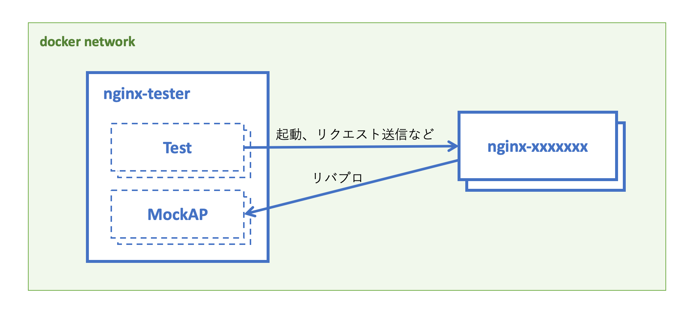

# 複雑怪奇な nginx を Go と Docker で自動テストする

TODO イントロを書く

## テスト対象の nginx

今回テスト対象とする nginx は以下のような設定になっています。

```nginx
server {
    listen 80;

    location / {
        proxy_pass http://${AP_SERVER_ADDR};
        proxy_set_header X-Request-Id $request_id;
    }

    location = /robots.txt {
        return 200 "User-agent: *\nDisallow: /\n";
    }

    location /secret/ {
        deny all;
    }

    location = /health {
        return 200 "OK";
    }
}
```

注目してほしいのは、`proxy_pass` の部分です。
APサーバーのアドレスを直接設定ファイルに埋め込むのではなく、`AP_SERVER_ADDR` という環境変数に切り出しています。
これは、テストする際にAPサーバーをモックサーバーに置き換える必要があるためです。

一般に、テスト環境と運用環境で異なる値を使う場合、そこを環境変数に切り出すことになります。これは普通のプログラミングにおける Dependency Injection に相当する作業です。

切り出した環境変数は、コンテナ起動時に [envsubst][envsubst] で具体的な値に展開します。

## テストの構成

ローカル環境でも CircleCI 環境でも実行できるようにするために、テストは以下のような構成になっています。



太い青枠で囲われた部分が Docker コンテナです。nginx-tester と nginx という２種類のコンテナがあります。nginx のコンテナに `-xxxxxx` という suffix が付いているのは、ランダムな suffix が付与されることを表しています。

テストは nginx-tester というコンテナの中で実行されます。
nginx-tester は `go test -v ./...` を実行するコンテナです。

nginx コンテナは、テストプログラムが動的に起動します。
テストケースごとに専用の nginx コンテナを立てるので、nginx コンテナは複数個起動されます。

nginx-tester と nginx が相互に通信できるようにするために、nginx コンテナは nginx-tester と同じ docker network 内に配置します。
この docker network は `run` というシェルスクリプトがテストの起動前に作成します。

AP のモックサーバーは独立したコンテナではなく、nginx-tester 内の goroutine として起動します。図の破線で囲われた部分が goroutine を表しています。

テストケースは並列に実行されるので、nginx のコンテナや MockAP は複数個同時に実行されます。nginx のコンテナ名に suffix が付けられているのは、同時実行したときに名前が被るのを防ぐためです。

[envsubst]: https://www.gnu.org/software/gettext/manual/gettext.html#envsubst-Invocation
