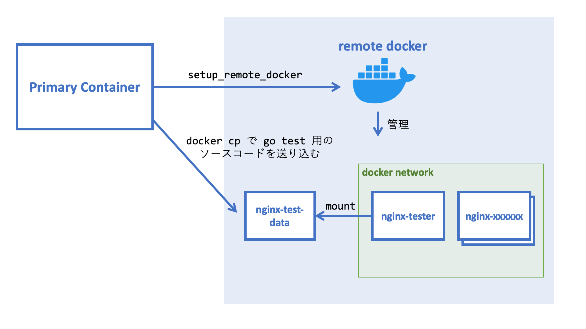

# 複雑怪奇な nginx を Go と Docker でユニットテストする

全国の nginx 職人のみなさま、こんにちは。野島([@nojima](https://twitter.com/nojima))です。

この記事では nginx のユニットテスト[^1]に関する知見を紹介したいと思います。

[^1]: ここでは nginx をひとつのユニットとみなしています（ユニットテストにおける「ユニット」が何を指すかは定義によって異なっており、統一されていません。この記事では nginx がひとつのユニットとなるような定義を採用したと解釈してください）。

## 背景

nginx は極めて柔軟なロードバランサであり、プロダクション環境ではその柔軟さを生かして多彩な役割を担っています。
我々の nginx は、ユーザーからのリクエストを AP サーバーに振り分け、アクセス制限を行い、リクエストをリダイレクトし、HTTPヘッダを付与したり削ったりしています。
しかし、nginx は便利な反面、その設定は極めて複雑になり、読解したり変更したりするのが難しくなっています。
そこで、**nginx をユニットテストする仕組み** を Go と Docker で作りました。

もともと nginx の設定を動作確認するには、データセンターにデプロイするしかありませんでした。
デプロイには結構時間がかかるので、動作確認はとても面倒でした。

ユニットテストの導入により動作確認は非常に効率化されました。
ユニットテストは他のサーバーに依存していないので、ローカル環境やCI環境でも実行できます。
よって、データセンターにデプロイすることなく、手元でサクッと動作を確認できます。
また、トピックブランチを CI 環境で常にテストしておくこともできます。

テストはすべて Docker の内側で行われるので、ローカル環境に特殊なセットアップをしておく必要はありません。
Docker がインストールされていれば動きます。

この記事では、このユニットテストの仕組みを説明していきたいと思います。

## サンプルコード

この記事のために説明用のサンプルコードを用意しました。
ローカルに clone してきて `make test` するとテストを実行できます。

https://github.com/cybozu/SAMPLE-test-nginx-with-go-and-docker

## テスト対象の nginx

サンプルコードでは、テスト対象となる nginx は以下のような設定になっています（一部抜粋）。
APサーバーにリバプロするエンドポイントや、常に 400 を返すエンドポイントなどがあります。

```nginx
server {
	listen 80;

	location / {
		proxy_pass http://${AP_SERVER_ADDR};
		...
	}

	location /secret/ {
		deny all;
	}

	...
}
```

注目してほしいのは、`proxy_pass` の部分です。
APサーバーのアドレスを直接設定ファイルに埋め込むのではなく、`AP_SERVER_ADDR` という環境変数に切り出しています。
これは、テストする際にAPサーバーをモックサーバーに置き換える必要があるためです。

切り出した環境変数は、コンテナ起動時に [envsubst][envsubst] で具体的な値に展開します。
サンプルコードでは [entrypoint というシェルスクリプト](https://github.com/cybozu/SAMPLE-test-nginx-with-go-and-docker/blob/master/sample-nginx/entrypoint)がその作業をやっています。

サンプルコードでは環境変数は `AP_SERVER_ADDR` のみでしたが、他にも環境によって値が変わる設定項目があればすべて環境変数に切り出す必要があります。
例えば、`resolver` を使っている場合、テスト環境では Docker の DNS サーバーである `127.0.0.11` を指定しないといけないので、環境変数に切り出します。

[envsubst]: https://www.gnu.org/software/gettext/manual/gettext.html#envsubst-Invocation

## テストの概観

テストコードの説明に入る前に、テストの概観を図を使って説明します。
ローカル環境でも CircleCI 環境でも実行できるようにするために、テストは以下のような構成になっています。


太い青枠で囲われた部分が Docker コンテナを表しています。nginx-tester と nginx という２種類のコンテナがあります。

- `nginx-tester`
    - `go test -v ./...` を実行するコンテナです。
    - テストの実行には Go と docker が必要なので、nginx-tester のイメージには `circleci/golang:1.14` を使っています。
	- nginx-tester は必要に応じて nginx コンテナを起動します。
	- コンテナの中から別のコンテナを起動するために **Docker outside of Docker** の構成を取っています。つまり、ホストの `/var/run/docker.sock` をコンテナ内にマウントすることで、コンテナからホストの docker を操作できるようにしています。

- `nginx-xxxxxx`
    - テスト対象となる nginx を格納しているコンテナです。
	- コンテナ名の `-xxxxxx` の部分は実際にはランダムな文字列です。これは、同時に複数個起動したときに名前が被るのを防ぐためです。

nginx-tester と nginx が相互に通信できるようにするために、nginx コンテナと nginx-tester は同じ docker network に所属しています。
この docker network はテストの起動前にシェルスクリプトで作成しておきます。

AP のモックサーバーは独立したコンテナではなく、nginx-tester 内の goroutine として起動します。図の破線で囲われた部分が goroutine を表しています。

次に CircleCI 上でどのようにテストを実行するかを説明します。
CircleCI では、`setup_remote_docker` を使って作成されたリモート環境で docker が実行されます。
私たちのテストは、このリモート環境の中で実行されます。



CircleCI でこのテストを走らせるにあたって、注意しないといけないのは次の２点です。

1. リモート環境と Primary Container (`config.yml` に書かれたステップを実行するコンテナ)の間では、セキュリティ上の理由から、HTTP や TCP などの通信が行えません。よって、リモート環境との通信は `docker` コマンドを用いたものに限定されます。
2. リモート環境では、Primary Container 上のファイルシステムが見れません。つまり、リモート環境からはソースコードが見えないということです。

実は、nginx-tester をローカルで直接実行せずにわざわざコンテナ内で実行していたのは、1 の問題を回避するためでした。

2 の問題に関しては [CircleCI の公式ドキュメントに回避策が載っています](https://circleci.com/docs/2.0/building-docker-images/#mounting-folders)。
以下の手順を行うことで、Primary Container から `nginx-tester` にソースコードを渡せます。

1. `nginx-test-data` という、空のボリュームを持つダミーのコンテナを作成する。
2. `docker cp` でソースコードをダミーコンテナに転送する。
3. `docker run` の `--volumes-from` オプションを使って、ダミーコンテナのボリュームをマウントする。

さて、テストの概観がわかったところで実際のテストコードを見ていきましょう。
まずはより簡単なリバプロなしの場合から始めます。

## テストコード (リバプロなし)

次のテストは `GET /secret/` で 400 が返ってくることを確認するものです。

```go
func TestSecretEndpoints(t *testing.T) {
	t.Parallel()

	nginx := StartNginx(t, NginxConfig{}) // ①
	defer nginx.Close(t)
	nginx.Wait(t)
	
	resp, err := http.Get(nginx.URL() + "/secret/") // ②
	if err != nil {
		t.Fatal(err)
	}
	defer resp.Body.Close()

	if resp.StatusCode != http.StatusForbidden { // ③
		t.Errorf("status code should be 400, but %d", resp.StatusCode)
	}
}
```

① `StartNginx()` は nginx コンテナを起動する関数です。詳細は後述します。 
次に `nginx.Wait()` で起動が完了するまで待ちます。

② nginx に対して `GET /secret/` を行います。`http.Get()` は単なる Go の標準関数です。

③ レスポンスを assert します。これも普通の Go のテストコードです。

前節では Docker を使ってテストすると説明しましたが、Docker はこのテストケースのコードからは完全に隠蔽されています。
これは、Docker にまつわる複雑さをテストケースから分離することで、テストケースを読みやすくするためです。

テストコードでは関心の分離や単一責任の原則が蔑ろにされることがよくありますが、私はテストコードでもこれらの原則は重要であると考えています。

Docker を実際に操作しているのは `StartNginx()` や `nginx.Close()` などの関数です。
それでは `StartNginx()` の実装を見ていきましょう。

## StartNginx()

`StartNginx()` の肝となる部分は以下のコードです。この関数の主な仕事は docker コマンドを叩くことです。

```go
// docker コマンドを叩いて sample-nginx:latest を起動する。
args := []string{
	"run", "--rm",
	"--name", name,
	"--net", network,
	"-e", fmt.Sprintf("AP_SERVER_ADDR=%s", config.APServerAddress),
	"sample-nginx:latest",
}
cmd := exec.Command("docker", args...)
if err := cmd.Start(); err != nil {
	t.Fatal(err)
}
```

このコードで注目してほしい点は、`-e` で `AP_SERVER_ADDR` に値を渡していることです。
これにより、任意のAPサーバーを差し込んで nginx を起動できるわけです。
それでは、実際にAPサーバーを差し込むテストを見ていきましょう。

## テストコード (リバプロあり)

次のテストは AP サーバーをモックしてリバプロの挙動を確認するものです。

```go
func TestReverseProxy(t *testing.T) {
	t.Parallel()

	ap := StartMockAP(t) // ①
	defer ap.Close(t)

	nginx := StartNginx(t, NginxConfig{ // ②
		APServerAddress: ap.Address(),
	})
	defer nginx.Close(t)
	nginx.Wait(t)

	resp, err := http.Get(nginx.URL() + "/") // ③
	if err != nil {
		t.Fatal(err)
	}
	defer resp.Body.Close()

	if resp.StatusCode != http.StatusOK {
		t.Errorf("status code should be 200, but %d", resp.StatusCode)
	}

	body, err := ioutil.ReadAll(resp.Body)
	if err != nil {
		t.Fatal(err)
	}
	if string(body) != "I am AP server" {
		t.Errorf("unexpected response body: %s", string(body))
	}
}
```

① `StartMockAP()` でモックAPを起動しています。

② `StartNginx()` で nginx コンテナを起動します。ここでモックAPのアドレスを差し込んでいることに注目してください。

③ AP と nginx を起動できたら、あとはもう普通のテストです。リクエストを送り、レスポンスを普通に assert しましょう。

MockAP を Nginx に差し込んでいる部分は OOP における Dependency Injection に相当します。
普通、Dependecy Injection は同じプロセス内のオブジェクトに対して行うのですが、この例だと別のプロセスに対して依存オブジェクトを差し込んでいる形になっているのが面白いところです。

それでは最後に `StartMockAP()` の実装を見てみましょう。

## StartMockAP()

`StartMockAP()` は以下のようになっています（一部説明に不要な部分を省略しています）。
ポートを自動的に選ぶためにちょっと特殊なことをしていることを除けば、単に goroutine で HTTP サーバーを立てているだけです。 

```go
// 空いているポートを自動的に選ぶ
l, err := net.Listen("tcp", ":0")
if err != nil {
	t.Fatal(err)
}

handler := func(w http.ResponseWriter, req *http.Request) {
	w.Write([]byte("I am AP server"))
}
ap := &MockAP{
	host: host,
	port: l.Addr().(*net.TCPAddr).Port,
	server: &http.Server{
		Handler: http.HandlerFunc(handler),
	},
}

// 別の goroutine でサーバーを走らせる
go func() {
	if err := ap.server.Serve(l); err != nil && err != http.ErrServerClosed {
		t.Log(err)
	}
}()
```

なお、標準ライブラリの `httptest` で `StartMockAP` と同じようなことができますが、`httptest` はアドレスを `127.0.0.1` にバインドしてしまうので、今回のユースケースでは利用できません。

今回のサンプルコードでは一種類の MockAP しか実装されていませんが、私達が実際に使っているテストでは様々な MockAP が実装されています。
例えば、レスポンスを一切返さない MockAP や、不正な SSL 証明書を持つ MockAP などがあります。
これらの MockAP を使うことで、手動で起こすのが面倒なケースをテストすることができます。

## まとめ

Go と Docker を使って nginx をテストする仕組みを紹介しました。
この仕組みは、我々のプロダクション環境における nginx を支えています。

この記事がみなさまの nginx ライフの一助となれば幸いです。
